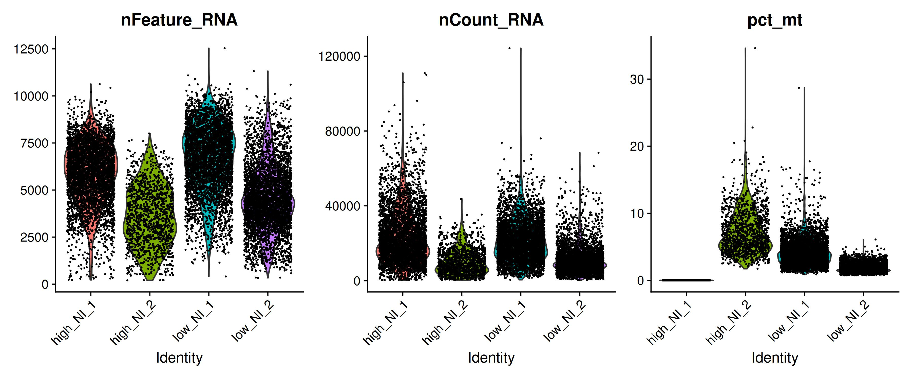
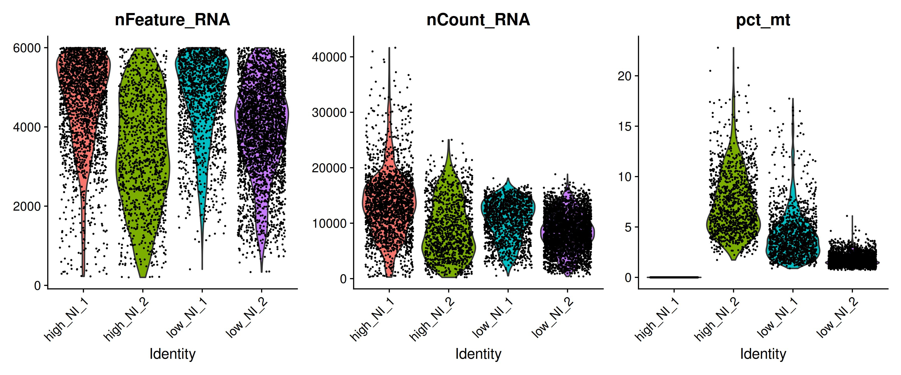

# 01 Preprocessing

This is the starting point of the whole reproduction pipeline. Before any group member can do clustering, cell type annotation, or spatial analysis (any step of the pipeline), the raw single-cell RNA sequencing data needs to be cleaned up and made comparable across samples. That is what this part does.

---

## Dataset

The data comes from four pancreatic ductal adenocarcinoma (PDAC) tumor samples submitted on GEO under accession [GSE278694](https://www.ncbi.nlm.nih.gov/geo/query/acc.cgi?acc=GSE278694). The original paper profiled patients with varying degrees of neural invasion (NI), which is basically how much cancer has spread into surrounding nerves. Two samples come from high neural invasion patients and two from low neural invasion patients:

| Sample ID | GEO Accession | Condition |
|-----------|---------------|-----------|
| PA01 | GSM8552940 | High NI |
| PA02 | GSM8552941 | High NI |
| PA21 | GSM8552952 | Low NI |
| PA22 | GSM8552953 | Low NI |

Each file is an HDF5 (.h5) filtered feature-barcode matrix produced by Cell Ranger, which is the standard 10x Genomics output format. These contain raw UMI counts per gene per cell barcode.

---

## Platform

- **OS:** Ubuntu 24 (Linux)
- **Language:** R
- **Environment:** Run via `Rscript` from terminal (not RStudio, not Colab)

---

## Dependencies

```bash
Rscript -e "install.packages('BiocManager', repos='https://cloud.r-project.org'); BiocManager::install('Seurat')"
Rscript -e "install.packages(c('harmony', 'hdf5r', 'ggplot2'), repos='https://cloud.r-project.org')"
```

Seurat is the main framework for single-cell analysis. hdf5r is needed to read the .h5 files. ggplot2 handles the QC plots. harmony is used for batch correction across the four samples.

---

## Workflow

### Step 1: Load the raw data

```r
library(Seurat)
library(harmony)
library(ggplot2)

data_dir <- "~/Documents/Repos/pdac-neural-invasion-reproduction/data/raw"
out_dir  <- "~/Documents/Repos/pdac-neural-invasion-reproduction/01_preprocessing/results"
dir.create(out_dir, showWarnings = FALSE, recursive = TRUE)

sample_files <- list(
    high_NI_1 = file.path(data_dir, "GSM8552940_PA01_filtered_feature_bc_matrix.h5"),
    high_NI_2 = file.path(data_dir, "GSM8552941_PA02_filtered_feature_bc_matrix.h5"),
    low_NI_1  = file.path(data_dir, "GSM8552952_PA21_filtered_feature_bc_matrix.h5"),
    low_NI_2  = file.path(data_dir, "GSM8552953_PA22_filtered_feature_bc_matrix.h5")
)
```

Each .h5 file is a sparse matrix of gene counts across thousands of cell barcodes. We  start with labeling each sample with its ID and condition so that information is preserved throughout the analysis. `Read10X_h5` reads the compressed matrix and `CreateSeuratObject` covers it into a Seurat object that all downstream analysis functions work with.

### Step 2: Compute per-cell QC metrics

```r
load_sample <- function(path, sample_id)
{
    counts <- Read10X_h5(path)
    obj    <- CreateSeuratObject(counts, project = sample_id, min.cells = 3, min.features = 200)
    obj$sample_id <- sample_id
    obj$condition <- ifelse(grepl("high", sample_id), "high_NI", "low_NI")
    obj[["pct_mt"]] <- PercentageFeatureSet(obj, pattern = "^MT-")
    obj
}

seurat_list <- mapply(load_sample, sample_files, names(sample_files), SIMPLIFY = FALSE)
```

The most really important metric here is the mitochondrial gene percentage (`pct_mt`). Mitochondrial genes start with `MT-` in human data. Cells with very high mitochondrial content are usually damaged or dying, because when a cell lyses, cytoplasmic mRNA leaks out but mitochondria stay intact, so you end up sequencing a lot of mitochondrial reads relative to the real transcriptome content. We also look at `nFeature_RNA` (number of detected genes) and `nCount_RNA` (total UMIs). Low gene counts often mean empty droplets or dead cells. Very high gene counts can mean two cells were captured in one droplet (doublets).

### Step 3: Merge samples and visualize QC before filtering

```r
merged <- merge(seurat_list[[1]], y = seurat_list[-1], add.cell.ids = names(seurat_list))

qc_before <- VlnPlot(merged, features = c("nFeature_RNA", "nCount_RNA", "pct_mt"), ncol = 3)
ggsave(file.path(out_dir, "01_qc_before_filter.jpeg"), qc_before, width = 12, height = 5)
```

We merge all 4 samples into a single object before filtering so the violin plots show the distribution across all samples together. This lets you see the overall quality landscape and pick sensible cutoffs.

### Step 4: Filter low-quality cells and visualize QC after filtering

```r
merged <- subset(merged, subset = nFeature_RNA > 200 & nFeature_RNA < 6000 & pct_mt < 25)

qc_after <- VlnPlot(merged, features = c("nFeature_RNA", "nCount_RNA", "pct_mt"), ncol = 3)
ggsave(file.path(out_dir, "02_qc_after_filter.jpeg"), qc_after, width = 12, height = 5)
```

After filtering we regenerate the same three violin plots so you can directly compare the before and after distributions. Cells with fewer than 200 detected genes are almost certainly empty droplets. Cells with more than 6000 are likely doublets. Cells with more than 25% mitochondrial reads are likely dead or damaged.


### Step 5: Normalize and find variable features

```r
merged <- NormalizeData(merged)
merged <- FindVariableFeatures(merged, nfeatures = 2000)
merged <- ScaleData(merged)
merged <- RunPCA(merged, npcs = 30)
```

Raw counts are not directly comparable across cells because each cell has a different total number of reads captured. Normalization divides each cell's counts by its total, then multiplies by 10,000 (log normalization), making values comparable. We then identify the 2000 most variably expressed genes, which are the informative ones that differ meaningfully between cell types. Scaling centers and scales expression so that highly expressed genes do not dominate the PCA. PCA then reduces the data from thousands of gene dimensions down to 30 principal components that capture the main sources of variation.

### Step 6: Harmony batch correction and save output

```r
merged <- RunHarmony(merged, group.by.vars = "sample_id", dims.use = 1:20)

saveRDS(merged, file.path(data_dir, "../processed_subset.rds"))
```

Even after normalization, cells from different patients will cluster by patient rather than by cell type, because there are patient-specific technical and biological differences. Harmony corrects for this by iteratively adjusting the PCA embedding until cells group by biology rather than by which patient they came from. We use the first 20 PCs as input to Harmony. The final processed Seurat object is saved as an .rds file, which is what the clustering and annotation step loads directly.

---

## Results



Violin plots of QC metrics across all four samples before filtering. Gene counts, total UMI counts, and mitochondrial percentage are shown per sample.



The same metrics after applying filters (200 to 6000 genes per cell, under 25% mitochondrial reads). Distributions are tighter and comparable across all four samples.


---

## Output

The main output gets passed to the next stage is `data/processed_subset.rds`, a 216MB Seurat object containing all four samples merged, filtered, normalized, and Harmony-integrated. For clustering step, the file is loaded with:

```r
merged <- readRDS("path/to/processed_subset.rds")
```

This file is too large for GitHub (above the 100MB limit) so it is shared separately via [Google Drive](https://drive.google.com/file/d/160K5EYsv9vKkPDBecVerEKo63Ih-o8BS/view?usp=sharing).

---

## Reference

Chen MM, Gao Q, Ning H, et al. Integrated single-cell and spatial transcriptomics uncover distinct cellular subtypes involved in neural invasion in pancreatic cancer. *Cancer Cell.* 2025. [https://doi.org/10.1016/j.ccell.2025.04.014](https://doi.org/10.1016/j.ccell.2025.04.014)

Original author code: [https://github.com/PDAC-zhanglab/PDAC](https://github.com/PDAC-zhanglab/PDAC)
