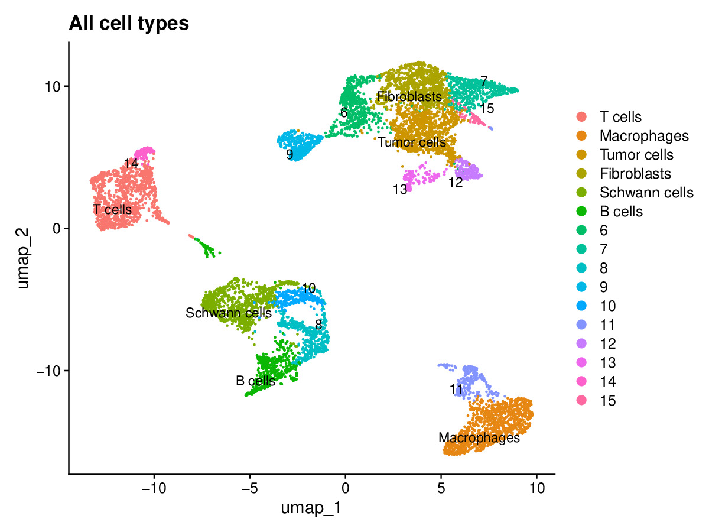
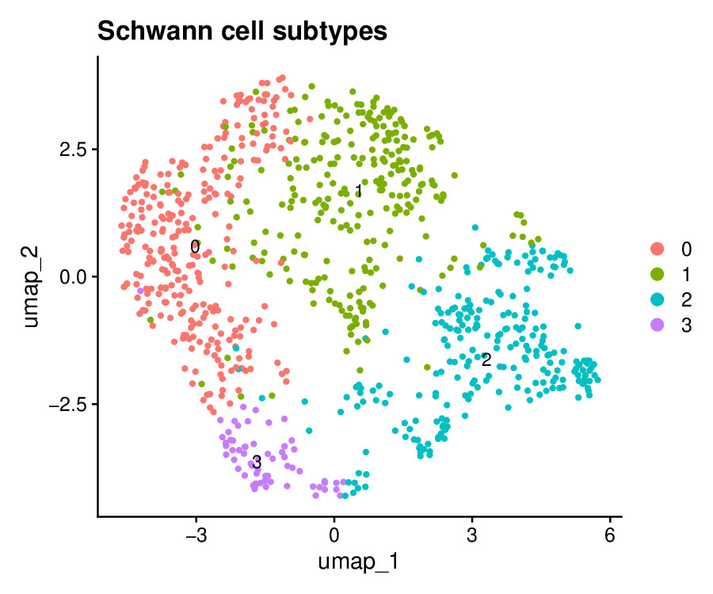
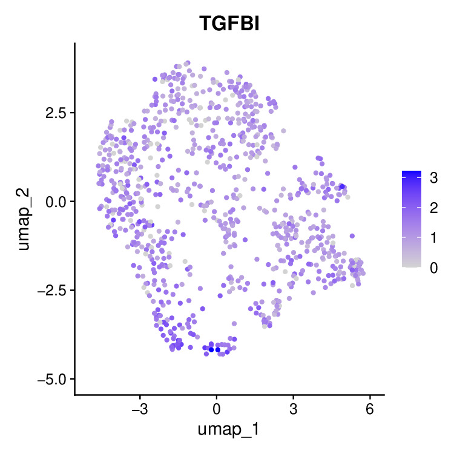
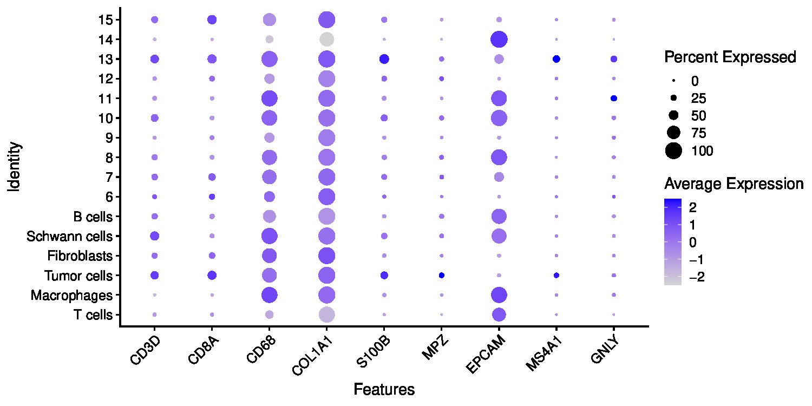

# 02 Clustering and Cell Type Annotation

After preprocessing, the integrated Seurat object contains tens of thousands of cells from four PDAC patient samples, all normalized and batch-corrected. But at that point the cells are just an undifferentiated cloud. This step takes that cloud and groups cells by how similar their gene expression is, then figures out what biological type each group corresponds to. That is what clustering and annotation means.

---

## Dataset

The input to this step is the processed Seurat object produced by `01_preprocessing`. It contains cells from four samples (PA01, PA02, PA21, PA22), two high neural invasion and two low neural invasion patients, after QC filtering, normalization, and Harmony batch correction.

The annotated output object produced by this step is also shared on Google Drive:
[seurat_annotated.rds](https://drive.google.com/file/d/1ryLXO039N7qAKlUpBURpybJrs201RhQy/view?usp=sharing)

---

## Dependencies

```bash
Rscript -e "install.packages('BiocManager', repos='https://cloud.r-project.org'); BiocManager::install('Seurat')"
Rscript -e "install.packages(c('ggplot2', 'dplyr'), repos='https://cloud.r-project.org')"
```

Seurat handles clustering, UMAP, marker finding, and feature plots. ggplot2 and dplyr are used for visualization and data manipulation.

---

## Workflow

### Step 1: Load the preprocessed object and run clustering

```r
library(Seurat)
library(ggplot2)

merged <- readRDS("path/to/processed_subset.rds")

merged <- FindNeighbors(merged, reduction = "harmony", dims = 1:20)
merged <- FindClusters(merged, resolution = 0.5)
merged <- RunUMAP(merged, reduction = "harmony", dims = 1:20)
```

Seurat builds a nearest-neighbor graph in the Harmony-corrected PCA space, then runs the Louvain algorithm to find clusters. Resolution controls how fine-grained the clusters are. UMAP then projects the high-dimensional space down to two dimensions for visualization.

### Step 2: Find marker genes for each cluster

```r
markers <- FindAllMarkers(merged, only.pos = TRUE, min.pct = 0.25, logfc.threshold = 0.25)
top_markers <- markers %>% group_by(cluster) %>% top_n(n = 5, wt = avg_log2FC)
```

For each cluster, Seurat compares that cluster against all others and finds genes that are significantly higher in that cluster. These marker genes are what we use to identify what cell type each cluster represents.

### Step 3: Annotate clusters using known marker genes

```r
new_labels <- c(
    "0" = "Tumor cells",
    "1" = "Macrophages",
    "2" = "T cells",
    "3" = "Fibroblasts",
    "4" = "Schwann cells",
    "5" = "B cells"
)
merged <- RenameIdents(merged, new_labels)
```

Cell types were identified by matching cluster marker genes against known canonical markers from the literature. The table below shows the markers used:

| Cell Type | Marker Gene |
|-----------|-------------|
| Tumor cells | EPCAM, KRT19 |
| Macrophages | C1QC, CD68 |
| T cells | CD3D, CD8A |
| Fibroblasts | COL1A1, ACTA2 |
| Schwann cells | SOX10, MPZ |
| B cells | CD79A |

### Step 4: Schwann cell subclustering

```r
schwann <- subset(merged, idents = "Schwann cells")
schwann <- FindNeighbors(schwann, reduction = "harmony", dims = 1:20)
schwann <- FindClusters(schwann, resolution = 0.3)
schwann <- RunUMAP(schwann, reduction = "harmony", dims = 1:20)
```

Because the paper specifically focuses on Schwann cell subtypes, we extracted only the Schwann cells and re-clustered them at a finer resolution to identify subtypes within this population.

### Step 5: Visualize TGFBI expression

```r
FeaturePlot(schwann, features = "TGFBI")
```

TGFBI is the key marker gene the paper identifies as driving neural invasion in a specific Schwann cell subtype. This plot shows where in the Schwann cell UMAP TGFBI expression is concentrated.

---

## Results

### UMAP of Major Cell Types



UMAP showing all major cell populations identified in the PDAC tumor microenvironment. Each color represents a distinct cell type identified through marker gene annotation.

### Schwann Cell Subtypes



Subclustering of Schwann cells reveals multiple distinct states within this population. The original paper showed that specific Schwann cell subtypes, particularly TGFBI-expressing ones, play an active role in neural invasion.

### TGFBI Feature Plot



Expression of TGFBI across the Schwann cell UMAP. The enrichment in specific subclusters confirms the existence of a TGFBI-positive Schwann cell subpopulation consistent with the paper's findings.

### Marker Gene Dot Plot



Dot plot validating cluster annotations using canonical marker genes. Dot size shows the percentage of cells in a cluster expressing that gene, and color intensity shows the average expression level. The clear marker specificity confirms the annotation strategy is correct.

---

## Output

The annotated Seurat object is saved as `seurat_annotated.rds` and shared via Google Drive (link above). This is the object used by `04_cellchat_survival` for CellChat and trajectory analysis.

---

## Reference

Chen MM, Gao Q, Ning H, et al. Integrated single-cell and spatial transcriptomics uncover distinct cellular subtypes involved in neural invasion in pancreatic cancer. *Cancer Cell.* 2025. [https://doi.org/10.1016/j.ccell.2025.04.014](https://doi.org/10.1016/j.ccell.2025.04.014)
