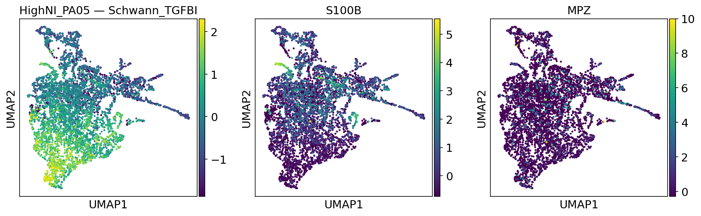
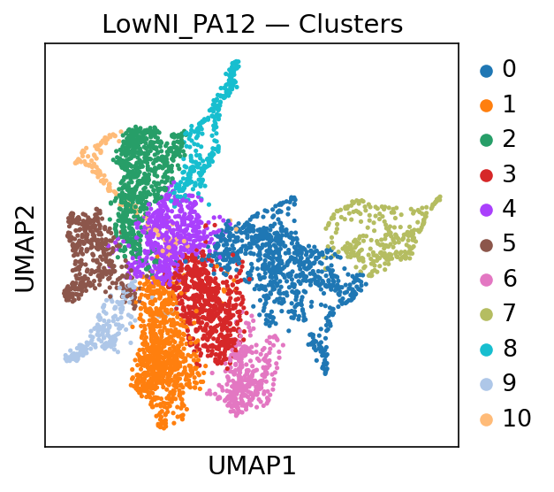
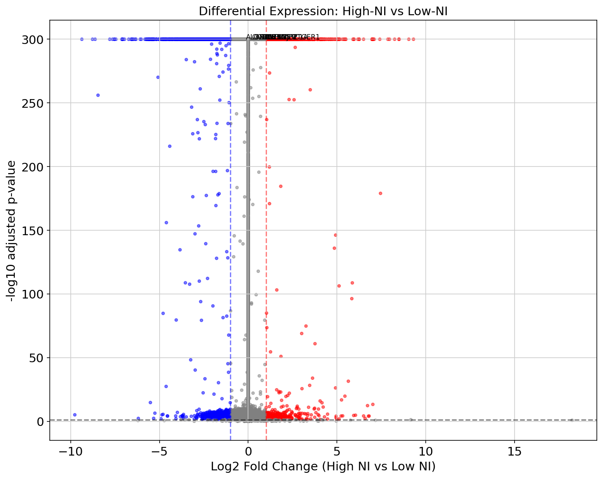
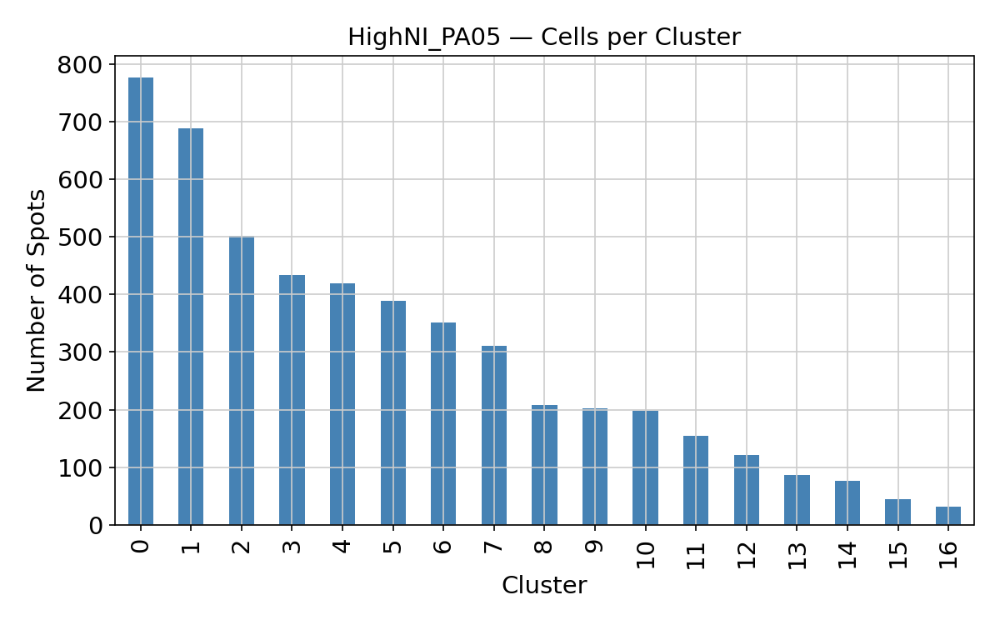
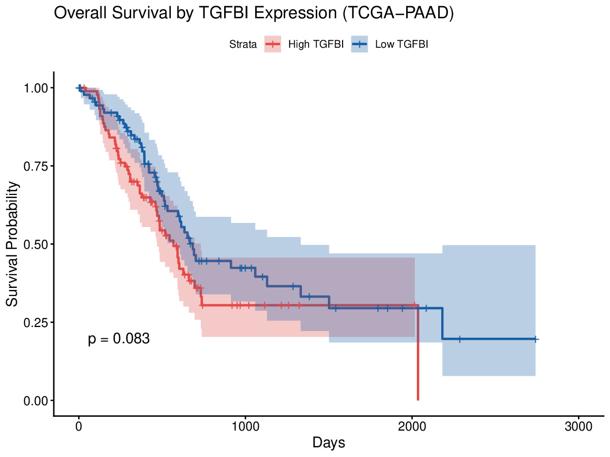
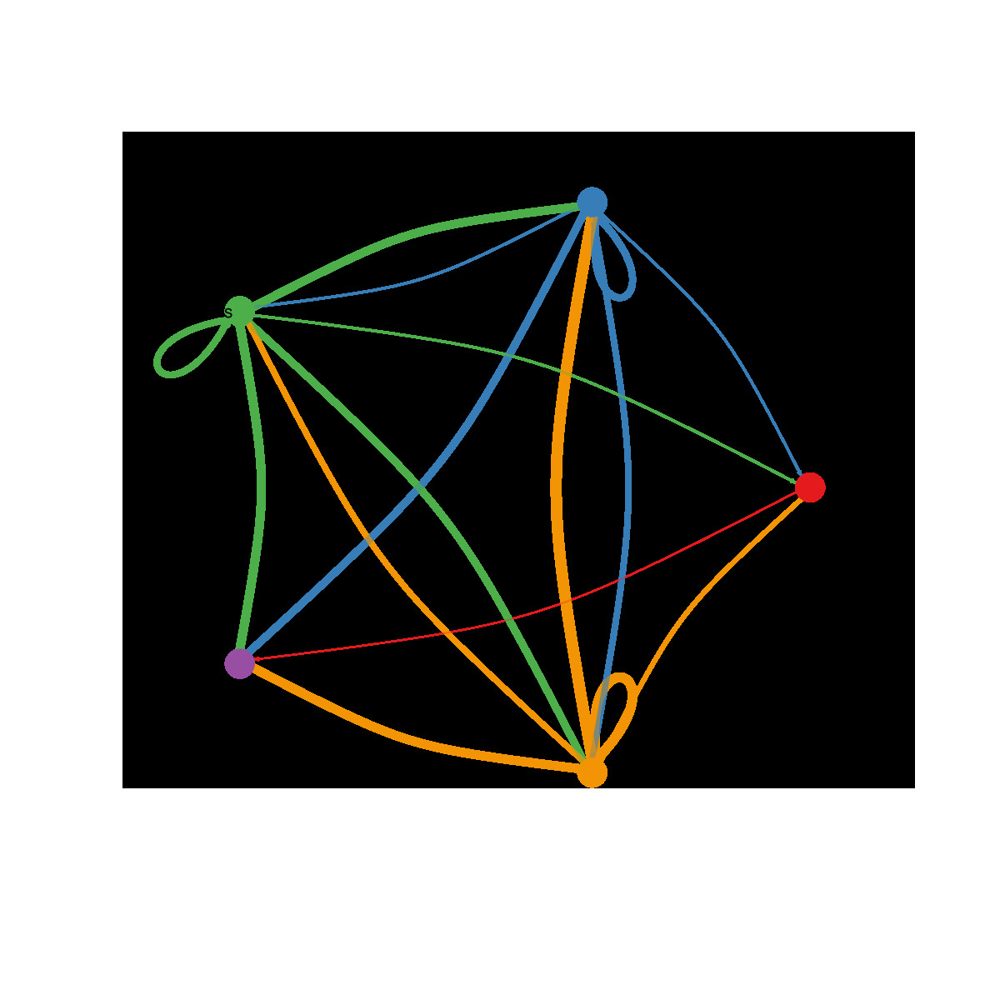
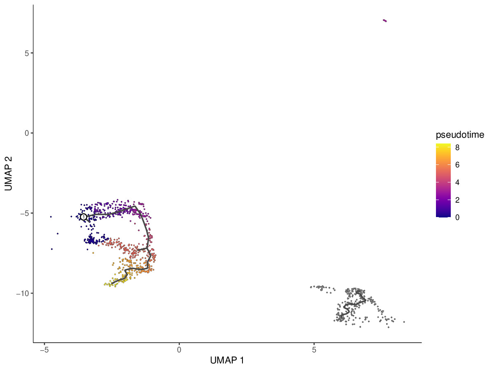

# PDAC Neural Invasion Reproduction

This repository reproduces key analyses from Chen et al. 2025, a study published in *Cancer Cell* that used single-cell and spatial transcriptomics to characterize the tumor microenvironment in pancreatic ductal adenocarcinoma (PDAC) with varying degrees of neural invasion. Neural invasion is the process by which tumor cells physically spread into surrounding nerves, and patients with high neural invasion have significantly worse survival outcomes. The paper identified a TGFBI-positive Schwann cell subtype as a key driver of this process.

The reproduction covers four parts of the analysis pipeline: preprocessing of single-cell RNA-seq data, cell type clustering and annotation, spatial transcriptomics analysis of Visium slides, and survival and cell communication analysis using TCGA data.

For detailed methodology, results, and code for each part, see the individual READMEs linked in each directory section below.

---

## Paper

Chen MM, Gao Q, Ning H, et al. Integrated single-cell and spatial transcriptomics uncover distinct cellular subtypes involved in neural invasion in pancreatic cancer. *Cancer Cell.* 2025. [https://doi.org/10.1016/j.ccell.2025.04.014](https://doi.org/10.1016/j.ccell.2025.04.014)

Original author code: [https://github.com/PDAC-zhanglab/PDAC](https://github.com/PDAC-zhanglab/PDAC)

---

## Repository Structure

```
pdac-neural-invasion-reproduction/
│
├── 01_preprocessing/                  QC, normalization, Harmony batch correction of scRNA-seq data
│   ├── results/
│   │   ├── 01_qc_before_filter.jpeg   violin plots of QC metrics before filtering
│   │   └── 02_qc_after_filter.jpeg    violin plots of QC metrics after filtering
│   ├── qc_normalization.R             full preprocessing pipeline script
│   └── Readme.md
│
├── 02_clustering_annotation/          cell clustering, UMAP, marker gene annotation, Schwann subclustering
│   ├── results/
│   │   ├── umap_celltypes.jpeg        UMAP colored by annotated cell type
│   │   ├── umap_schwann_subtypes.jpeg UMAP of Schwann cell subclusters
│   │   ├── featureplot_TGFBI.jpeg     TGFBI expression across Schwann cells
│   │   └── dotplot_markers.jpeg       dot plot validating cluster annotations
│   └── Readme.md
│
├── 03_spatial_transcriptomics/        Visium spatial data QC, clustering, marker mapping, differential expression
│   ├── results/                       all UMAP and spatial plots (PNG)
│   ├── spatial_transcriptomics.py     analysis script
│   └── Readme.md
│
├── 04_cellchat_survival/              CellChat TGF-beta signaling, Monocle3 trajectory, TCGA survival analysis
│   ├── results/
│   │   ├── tgfbi_survival_plot.jpeg   Kaplan-Meier survival curve by TGFBI expression
│   │   ├── cellchat_tgfb_plot.jpeg    TGF-beta cell communication network
│   │   └── monocle3_trajectory.jpeg   Schwann cell pseudotime trajectory
│   ├── scripts_analysis.R             full analysis script
│   └── Readme.md
│
├── data/                              raw data not tracked by git (see .gitignore)
├── .gitignore
├── LICENSE
└── README.md
```

---

## Background

Pancreatic ductal adenocarcinoma is one of the most lethal solid tumors, partly because it is typically diagnosed late and partly because the tumor actively invades the nerves running through the pancreas. This neural invasion correlates strongly with pain, local recurrence, and poor prognosis. Before this paper, the specific cell types enabling or resisting this invasion were not well characterized at single-cell resolution.

Chen et al. addressed this by profiling 23 patient samples with scRNA-seq and snRNA-seq alongside spatial Visium transcriptomics, comparing tissue from patients with high versus low neural invasion. The central finding is that a distinct TGFBI-positive Schwann cell subtype, induced by TGF-beta signaling from tumor cells and macrophages in the perineural microenvironment, promotes cancer cell migration and nerve infiltration.

---

## Key Integrative Finding

The central value of combining scRNA-seq and spatial transcriptomics is that one tells you *what* a cell is and the other tells you *where* it is. Neither technology alone answers both questions.

The clustering and annotation step's TGFBI feature plot (below, left) shows that TGFBI expression is concentrated in a specific Schwann cell subcluster within the scRNA-seq data. This identifies TGFBI-positive Schwann cells as a transcriptionally distinct subpopulation at single-cell resolution. But scRNA-seq loses all spatial information: you cannot tell where in the actual tumor tissue these cells are sitting.

The spatial transcriptomics analysis (below, right) answers exactly that. The Visium slides show TGFBI expression mapped onto the tissue section, revealing that TGFBI-positive signal is elevated in High-NI samples compared to Low-NI samples, physically localizing these cells to the perineural region.

Together, the two modalities form one argument: scRNA-seq resolves the subpopulation, spatial transcriptomics places it at the nerve invasion front.


TGFBI-positive Schwann cells identified as a distinct subcluster in the scRNA-seq UMAP (02_clustering_annotation).



TGFBI expression mapped onto Visium spatial data from a High-NI sample (PA05), showing elevated signal in the perineural region (03_spatial_transcriptomics).


---


## Data

All raw data is from GEO accession [GSE278694](https://www.ncbi.nlm.nih.gov/geo/query/acc.cgi?acc=GSE278694).

Large processed objects that exceed GitHub's file size limit are shared via Google Drive:

- `processed_subset.rds` (216 MB, output of `01_preprocessing`): [Google Drive link](https://drive.google.com/file/d/160K5EYsv9vKkPDBecVerEKo63Ih-o8BS/view?usp=sharing)
- `seurat_annotated.rds` (output of `02_clustering_annotation`): [Google Drive link](https://drive.google.com/file/d/1J_example_link_here/view?usp=sharing)
- Spatial Visium data (used in `03_spatial_transcriptomics`): [Google Drive folder](https://drive.google.com/drive/folders/1eALXvYj_y0KnL6aL_TokZauuRtQzlywi?usp=sharing)

---

## 01 Preprocessing

QC filtering, normalization, and Harmony integration of four scRNA-seq samples (PA01, PA02, PA21, PA22). Produces the processed Seurat object used by all downstream steps. See [`01_preprocessing/README.md`](01_preprocessing/README.md) for full details.


Violin plots of QC metrics across all four samples before filtering. Gene counts, total UMI counts, and mitochondrial percentage are shown per sample.


The same metrics after applying filters (200 to 6000 genes per cell, under 25% mitochondrial reads). Distributions are tighter and comparable across all four samples.

---

## 02 Clustering and Cell Type Annotation

Louvain clustering on the Harmony-corrected PCA embedding, UMAP visualization, marker gene identification, manual cell type annotation, and Schwann cell subclustering. See [`02_clustering_annotation/README.md`](02_clustering_annotation/README.md) for full details.


UMAP showing all major cell populations identified in the PDAC tumor microenvironment.


Subclustering of Schwann cells reveals multiple transcriptionally distinct states within this population.


TGFBI expression is concentrated in a specific Schwann cell subcluster, consistent with the paper's TGFBI-positive Schwann cell finding.


Dot plot validating cluster annotations using canonical marker genes for each cell type.

---

## 03 Spatial Transcriptomics

Scanpy-based analysis of four Visium slides (PA05, PA11, PA12, PA22), including QC, normalization, Leiden clustering, cell type annotation, High-NI vs Low-NI comparison, differential expression, and cluster proportion analysis. See [`03_spatial_transcriptomics/README.md`](03_spatial_transcriptomics/README.md) for full details.



Leiden clusters on a representative Low-NI slide.



Volcano plot of differential expression between High-NI and Low-NI spots. Red dots are upregulated in High-NI.



Cluster proportions in a representative High-NI sample.

---

## 04 CellChat, Trajectory, and Survival Analysis

TCGA-PAAD Kaplan-Meier survival analysis by TGFBI expression, CellChat TGF-beta signaling network inference, and Monocle3 pseudotime trajectory of Schwann cells. See [`04_cellchat_survival/README.md`](04_cellchat_survival/README.md) for full details.



Kaplan-Meier survival curves for 183 TCGA-PAAD patients split by TGFBI expression. High TGFBI patients trend toward worse survival (p = 0.083).



TGF-beta signaling network showing tumor cells and macrophages as the primary senders of TGF-beta signals to Schwann cells.



Pseudotime trajectory of Schwann cells, showing a transcriptional transition from a baseline state toward the TGFBI-positive activated state.

---

## References

Chen MM, Gao Q, Ning H, et al. Integrated single-cell and spatial transcriptomics uncover distinct cellular subtypes involved in neural invasion in pancreatic cancer. *Cancer Cell.* 2025. [https://doi.org/10.1016/j.ccell.2025.04.014](https://doi.org/10.1016/j.ccell.2025.04.014)

Stuart T, Butler A, Hoffman P, et al. Comprehensive integration of single-cell data. *Cell.* 2019. [https://doi.org/10.1016/j.cell.2019.05.031](https://doi.org/10.1016/j.cell.2019.05.031)

Korsunsky I, Millard N, Fan J, et al. Fast, sensitive and accurate integration of single-cell data with Harmony. *Nature Methods.* 2019. [https://doi.org/10.1038/s41592-019-0619-0](https://doi.org/10.1038/s41592-019-0619-0)

Jin S, Guerrero-Juarez CF, Zhang L, et al. Inference and analysis of cell-cell communication using CellChat. *Nature Communications.* 2021. [https://doi.org/10.1038/s41467-021-21246-9](https://doi.org/10.1038/s41467-021-21246-9)

Cao J, Spielmann M, Qiu X, et al. The single-cell transcriptional landscape of mammalian organogenesis. *Nature.* 2019. [https://doi.org/10.1038/s41586-019-0969-x](https://doi.org/10.1038/s41586-019-0969-x)
